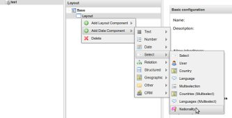

pimcore-spine
=============

Spine is a plugin of the Premier Open-Source Multichannel Platform [Pimcore](http://www.pimcore.org/). This plugin
 developed to complete the few missing pieces of pimcore and to easier the development of pimcore based development projects.

Spine uses the DRY concept and mainly focuses on the front-end part of the website.

### Data Object Fields

#### Nationality
Adds an "Nationality" Select field in the Object Data Component Context Menu.


```php
//Retrieving the available select options for nationality
$nationalities = Spine_Countries::getNationalities();

//Get nationality by nationality code
$nationality = Spine_Countries::getNationalityByCode('AE');
```